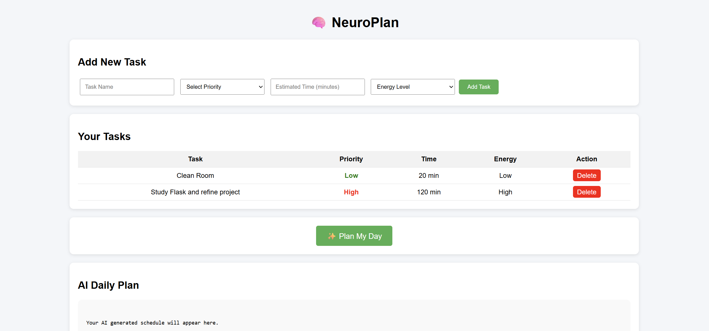

# 🧠 NeuroPlan – AI Adaptive Productivity & Wellness Planner

NeuroPlan is an AI-powered productivity and wellness planning web application that helps users intelligently organize daily tasks based on priority, time estimation, and energy levels. The system uses Generative AI to create balanced schedules, detect burnout risks, and provide productivity and wellness recommendations.

---

## 🚀 Live Demo

🌐 **Deployed Application:**  
👉 https://neuroplan-ai-productivity-planner.onrender.com

---

## 📌 Problem Statement

Students and professionals often create task lists but struggle with:

- Poor time management  
- Task overload and burnout  
- Lack of intelligent scheduling  
- No energy-aware productivity planning  

Most existing productivity tools only store tasks without helping users plan their day effectively.

---

## 💡 Solution

NeuroPlan introduces an AI-powered planning assistant that:

- Accepts tasks with priority, estimated time, and energy levels  
- Uses AI to generate realistic daily schedules  
- Detects burnout risks automatically  
- Suggests wellness and productivity tips  
- Provides a clean and intuitive web interface  

---

## ⚙️ Features

### ✅ Task Management
Users can:
- Add new tasks
- Assign priority levels (Low, Medium, High)
- Add estimated completion time
- Set energy mode (Low, Normal, High)
- View all tasks
- Delete tasks

---

### 🤖 AI Daily Planner
When the user clicks **"Plan My Day"**, the system:

- Collects all tasks from database
- Sends structured task data to Gemini AI
- Generates optimized daily schedule
- Suggests break intervals
- Balances high and low energy tasks

---

### 🔥 Burnout Detection
The AI analyzes workload and warns users if:

- Total estimated task duration exceeds 8 hours  
- Too many high-priority tasks are scheduled  

The planner then suggests redistributing or postponing tasks.

---

### 💡 Productivity & Wellness Tips
The AI provides:
- Focus improvement techniques
- Rest and energy recovery suggestions
- Time-blocking recommendations

---

## 🛠️ Tech Stack

Frontend:
- HTML
- CSS
- Jinja2 Template Engine

Backend:
- Python
- Flask Framework

Database:
- SQLite

AI Integration:
- Google Gemini API

Deployment:
- Render Hosting Platform
- GitHub Version Control

---

## 🧱 Project Architecture

User Browser
↓
Frontend (HTML + CSS)
↓
Flask Backend (Python)
↓
SQLite Database
↓
Gemini AI API
↓
AI Generated Schedule → Displayed to User

---

## 📂 Project Structure

ai-task-planner/
│
├── app.py
├── requirements.txt
│
├── templates/
│ └── index.html
│
└── static/
└── style.css

---

## 🔄 Application Workflow

1. User enters tasks via the UI  
2. Tasks are stored in SQLite database  
3. User clicks **Plan My Day**  
4. Backend fetches stored tasks  
5. Tasks are sent to Gemini AI using prompt engineering  
6. AI generates balanced daily schedule  
7. Output is displayed on user interface  

---

## 🧠 AI Prompt Engineering

The AI model is specifically instructed to:

- Prioritize tasks based on urgency  
- Schedule high-energy tasks during peak productivity periods  
- Insert break intervals  
- Detect burnout risks  
- Provide structured schedule output  
- Suggest productivity and wellness tips  

---

## 🔐 Security Practices

- API keys are stored using environment variables  
- No sensitive credentials stored in repository  
- All AI requests are handled securely via backend  

---

## 🧪 Local Installation & Setup

Clone repository:
git clone https://github.com/Goat4204/NeuroPlan-AI-Productivity-Planner.git

cd NeuroPlan-AI-Productivity-Planner

Install dependencies:
pip install -r requirements.txt

Set Gemini API key:

Windows:
setx GOOGLE_API_KEY "YOUR_API_KEY"

Linux / Mac:
export GOOGLE_API_KEY="YOUR_API_KEY"

Run application:

Open browser:
http://127.0.0.1:5000

---

## 🌐 Deployment

The application is deployed using **Render** with:

- GitHub integration
- Gunicorn production server
- Environment variable configuration
- Automatic deployment pipeline

---

## 🧠 Learning Outcomes

This project demonstrates knowledge of:

- Full-stack web development  
- REST API design using Flask  
- Database integration and CRUD operations  
- AI API integration and prompt engineering  
- UI/UX design fundamentals  
- Secure environment configuration  
- Cloud deployment pipeline  

---

## 🚧 Future Improvements

- User authentication system  
- Cloud database integration (PostgreSQL)  
- Calendar integration  
- Task completion tracking  
- Analytics dashboard  
- Mobile app version  

---

## 👨‍💻 Author

**Pratik Dhawale**

GitHub:
👉 https://github.com/Goat4204

Email:
👉 rajendradhawale12@gmail.com

---

## ⭐ Acknowledgements

- Flask Documentation  
- Google Gemini AI  
- Render Hosting Platform  

---

## 📜 License

This project is developed for educational and hackathon purposes.

